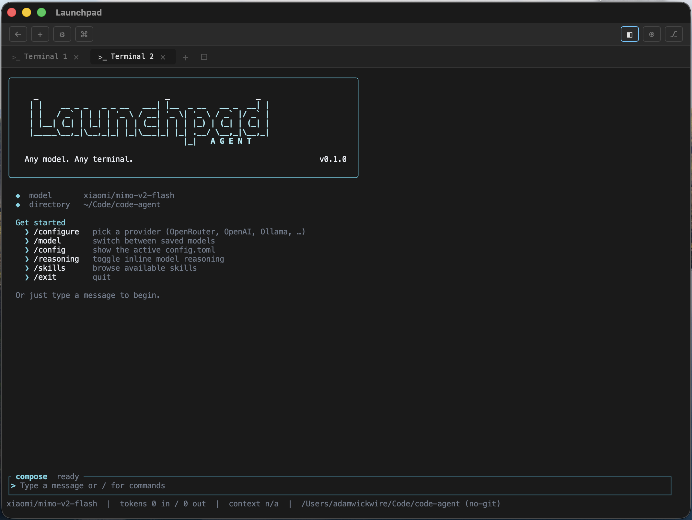
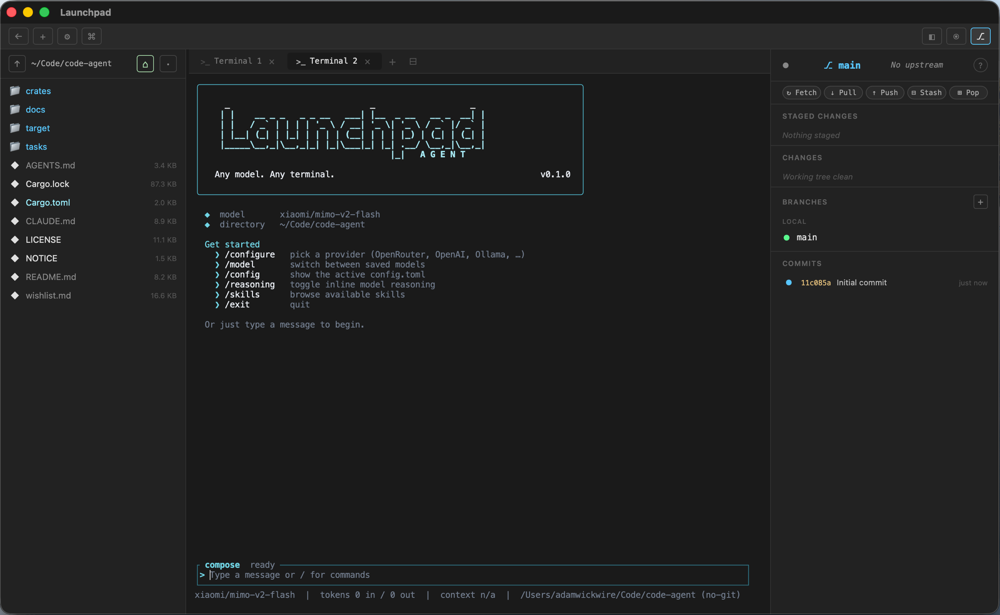

<div align="center">

# Launchpad Agent

**Any model. Any terminal.**

[](https://github.com/)
[](https://www.rust-lang.org/)
[](./LICENSE)
[](https://github.com/)

A Rust-based coding agent with a polished TUI, pluggable providers, and MCP support.
Early-stage, single-author project — usable today for daily coding, not yet production-ready.

Designed as a first-class companion to [Launchpad](https://github.com/WalrusQuant/launchpad), a modern terminal — though it runs in any terminal.



Running inside Launchpad with the file explorer and git panel open:



</div>

---

## Quick start

```bash
git clone https://github.com/launchpad/launchpad-agent && cd launchpad-agent
cargo install --path crates/cli

lpagent
```

This installs the `lpagent` binary to `~/.cargo/bin`, so you can run `lpagent` from any directory. (Make sure `~/.cargo/bin` is on your `PATH` — rustup adds it by default.)

Prefer not to install? Build and run it in place instead:

```bash
cargo build --release
./target/release/lpagent
```

Then inside the TUI:

```
/configure
```

Pick a provider from the preset list, **choose a model from the curated picker** (or pick "Custom model…" to type your own slug — the prompt shows a format example), and go. If you've already configured that provider, your saved API key is reused automatically — no re-typing. Or just type a message and Launchpad will walk you through setup on first use.

> [!TIP]
> Rust 1.85+ required. Install via <https://rustup.rs/>.

## Supported providers

Pick any of these from `/configure`:

| Preset        | Base URL                                                | Auth env var                                |
|---------------|---------------------------------------------------------|---------------------------------------------|
| Anthropic     | `https://api.anthropic.com`                             | `ANTHROPIC_API_KEY`                         |
| OpenAI        | `https://api.openai.com`                                | `OPENAI_API_KEY`                            |
| Google Gemini | `https://generativelanguage.googleapis.com`             | `GOOGLE_API_KEY` / `GEMINI_API_KEY`         |
| OpenRouter    | `https://openrouter.ai/api/v1`                          | `OPENROUTER_API_KEY`                        |
| Groq          | `https://api.groq.com/openai/v1`                        | `GROQ_API_KEY`                              |
| Together AI   | `https://api.together.xyz/v1`                           | `TOGETHER_API_KEY`                          |
| Mistral       | `https://api.mistral.ai/v1`                             | `MISTRAL_API_KEY`                           |
| DeepSeek      | `https://api.deepseek.com`                              | `DEEPSEEK_API_KEY`                          |
| xAI (Grok)    | `https://api.x.ai/v1`                                   | `XAI_API_KEY`                               |
| Fireworks AI  | `https://api.fireworks.ai/inference/v1`                 | `FIREWORKS_API_KEY`                         |
| Cerebras      | `https://api.cerebras.ai/v1`                            | `CEREBRAS_API_KEY`                          |
| Perplexity    | `https://api.perplexity.ai`                             | `PERPLEXITY_API_KEY`                        |
| Moonshot (Kimi)| `https://api.moonshot.ai/v1`                           | `MOONSHOT_API_KEY`                          |
| DeepInfra     | `https://api.deepinfra.com/v1/openai`                   | `DEEPINFRA_API_KEY`                         |
| Nebius        | `https://api.studio.nebius.ai/v1`                       | `NEBIUS_API_KEY`                            |
| Hyperbolic    | `https://api.hyperbolic.xyz/v1`                         | `HYPERBOLIC_API_KEY`                        |
| Novita AI     | `https://api.novita.ai/v3/openai`                       | `NOVITA_API_KEY`                            |
| SambaNova     | `https://api.sambanova.ai/v1`                           | `SAMBANOVA_API_KEY`                         |
| Lambda        | `https://api.lambda.ai/v1`                              | `LAMBDA_API_KEY`                            |
| Nvidia NIM    | `https://integrate.api.nvidia.com/v1`                   | `NVIDIA_API_KEY`                            |
| GitHub Models | `https://models.github.ai/inference`                    | `GITHUB_TOKEN`                              |
| Z.ai (coding) | `https://api.z.ai/api/coding/paas/v4`                   | `Z_AI_API_KEY`                              |
| Ollama (local)| `http://localhost:11434/v1`                             | —                                           |
| LM Studio (local)| `http://localhost:1234/v1`                          | —                                           |
| Custom        | you supply                                              | `LPA_API_KEY`                               |

Anthropic / OpenAI / Google use their native wire formats. The rest share an OpenAI-compatible chat-completions surface. Every non-custom provider ships a curated, selectable model list in `/configure`; a "Custom model…" row is always available if you need a slug that isn't listed.

## Slash commands

| Command          | Purpose                                                   |
|------------------|-----------------------------------------------------------|
| `/help`          | List the available slash commands                         |
| `/configure`     | Pick a provider, choose a model from the list, add it      |
| `/model`         | Switch between saved models                               |
| `/config`        | Show the active `config.toml` (API keys masked)           |
| `/reasoning`     | Toggle inline model reasoning display                     |
| `/skills`        | Browse available skills                                   |
| `/sessions`      | List previous sessions and switch                         |
| `/new`           | Start a new session                                       |
| `/rename`        | Rename the current session                                |
| `/status`        | Show turn / token / model status                          |
| `/thinking`      | Adjust thinking mode for capable models                   |
| `/compact`       | Summarize and compact the conversation context           |
| `/clear`         | Clear the context but keep the session                   |
| `/export`        | Export the transcript to a Markdown file                 |
| `/bug` `/feedback` | Show where to report bugs and feedback                  |
| `/release-notes` | Show the version and release-notes link                  |
| `/exit`          | Quit                                                      |

`/onboard` is kept as an alias for `/configure`. Type a line starting with `#`
to append a note to the project memory file (`AGENTS.md` / `CLAUDE.md`).

## Headless / scripting

Run a single prompt non-interactively and exit — no TUI:

```bash
lpagent -p "summarize the build errors"      # prompt as an argument
cat task.md | lpagent -p                      # or pipe it on stdin
```

Flags (headless): `--model`, `--system-prompt` / `--append-system-prompt`,
`--allowed-tools` / `--disallowed-tools` (comma-separated),
`--dangerously-skip-permissions`, `--verbose` / `--debug`. Exit codes are
`0` (success), `1` (failure), `2` (usage), so scripts can branch on the result.

## What works today

- **Streaming completions** against Anthropic, OpenAI, Google, or any OpenAI-compatible endpoint
- **Tool use** — bash, read, write, glob, grep, ls, apply_patch, webfetch, websearch, skill, update_plan, todowrite, question
- **MCP runtime** — stdio-transport MCP servers are auto-discovered from `config.toml` and their tools appear in the registry namespaced as `mcp__<server>__<tool>`
- **Session persistence** via rollout files in `~/.launchpad/agent/sessions/`
- **LLM-based context compaction** with JSON snapshots (falls back to naive oldest-message drop on summarizer failure)
- **Approval flow** with per-session tool/path/host caching so repeated asks don't re-bother you
- **Polished TUI** — slate + cyan palette, ASCII logo, slash-command suggestions, tool-call tree connectors, collapsible reasoning, tool-output previews

## What's stubbed or missing

Per the [`wishlist`](./wishlist.md):

- OS-level sandboxing (types defined, not enforced)
- Subagent dispatch (`TaskTool` is unregistered — no real orchestration yet)
- LSP client (`LspTool` is unregistered — no real language-server integration)
- Tool progress events (emitted types exist, not streamed end-to-end)
- Git "ghost" snapshots for turn-level undo
- Skill hot-reload, session sharing, web/desktop clients
- MCP transport beyond stdio (HTTP / Streamable-HTTP gated behind a `streamable-http` feature flag)

## Configuration

Launchpad reads `~/.launchpad/agent/config.toml` (override with `LPA_HOME`). Minimal config:

```toml
model = "meta-llama/llama-3.3-70b-instruct"
model_provider = "openrouter.ai"

[model_providers."openrouter.ai"]
name = "OpenRouter"
wire_api = "openai_chat_completions"
base_url = "https://openrouter.ai/api/v1"
api_key = "sk-or-v1-…"

[[model_providers."openrouter.ai".models]]
model = "meta-llama/llama-3.3-70b-instruct"
```

Env-var overrides: `LPA_PROVIDER`, `LPA_MODEL`, `LPA_WIRE_API`, `LPA_BASE_URL`, `LPA_API_KEY`.

Per-project overrides live at `<workspace>/.lpagent/config.toml`.

### MCP servers

Drop a `[[mcp.servers]]` block into `config.toml`:

```toml
[[mcp.servers]]
id = "github"
display_name = "GitHub MCP"
startup_policy = "lazy"
enabled = true
trust_level = "prompt"   # or "trusted" to skip approval for all its tools

[mcp.servers.transport]
kind = "stdio"
command = ["npx", "-y", "@modelcontextprotocol/server-github"]
```

## Architecture

Twelve crates, all prefixed `lpa-`:

| Crate       | Role                                                         |
|-------------|--------------------------------------------------------------|
| `cli`       | `lpagent` binary — `onboard`, `prompt`, `doctor`, `server`   |
| `core`      | Query loop, session model, compaction, config, skills        |
| `tools`     | Tool trait, built-in tool impls, orchestrator, MCP adapter   |
| `provider`  | Anthropic / OpenAI / Google SDKs behind a common trait       |
| `safety`    | Secret redaction, permission policy, approval cache          |
| `server`    | JSON-RPC runtime, session persistence, approval manager      |
| `protocol`  | Wire types, events, model catalog schema                     |
| `client`    | stdio + WebSocket transports                                 |
| `tui`       | Ratatui interactive terminal UI                              |
| `mcp`       | MCP protocol, stdio transport, supervisor, manager           |
| `tasks`     | Task-manager stubs                                           |
| `utils`     | `LPA_HOME` resolution, config path resolver                  |

The server and TUI communicate over JSON-RPC — swap the TUI for a web or desktop client without touching the core.

## Building & testing

```bash
cargo build --release
cargo test --workspace      # 421 tests should pass
cargo clippy --workspace
```

See [`CLAUDE.md`](./CLAUDE.md) for contributor guidelines and internal conventions.

## Contributing

The project is in its early design phase and there are many ways to help:

- **Architecture feedback** — review crate design and flag coupling
- **Implementation** — see the `wishlist.md` for unstarted items (tool progress, subagents, LSP, ghost snapshots, …)
- **Docs** — improve README, specs, or add tutorials

Open an issue or submit a PR.

## License

Licensed under the [Apache License, Version 2.0](./LICENSE).
